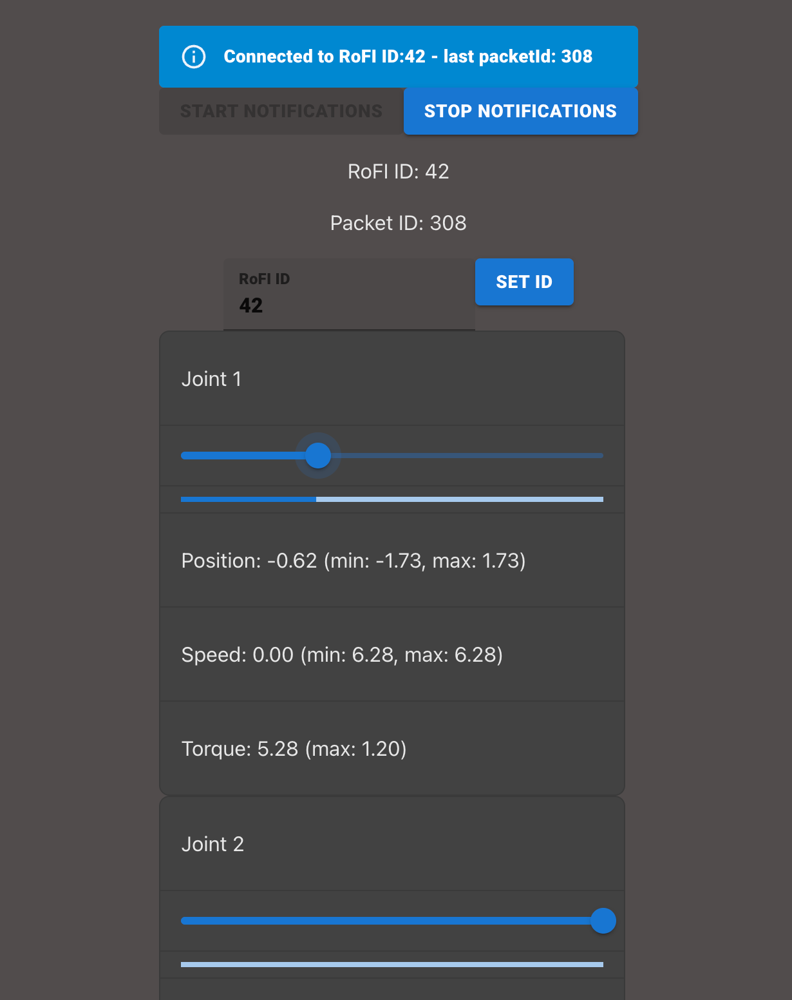

# RoFI web controller

This is a web controller for RoFI modules. It is a web application that allows to control RoFI modules using BLE communication. The application is written in TypeScript and uses React for the user interface.

